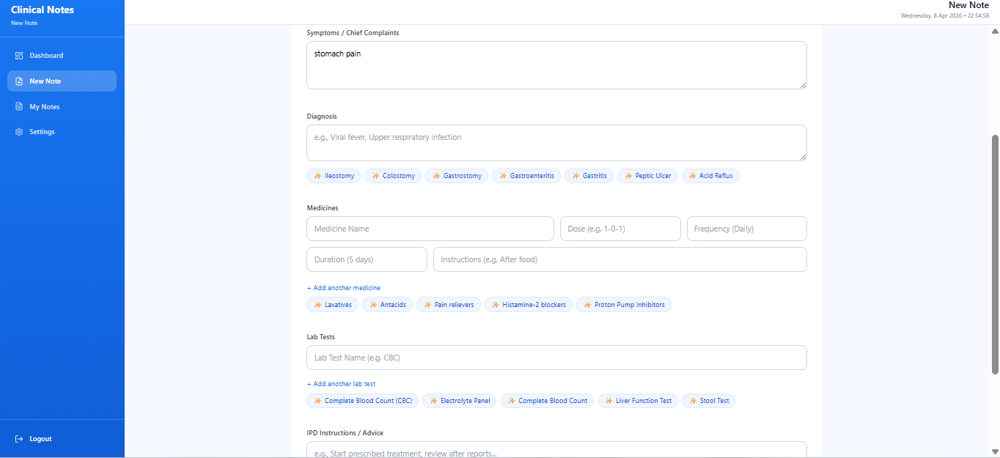
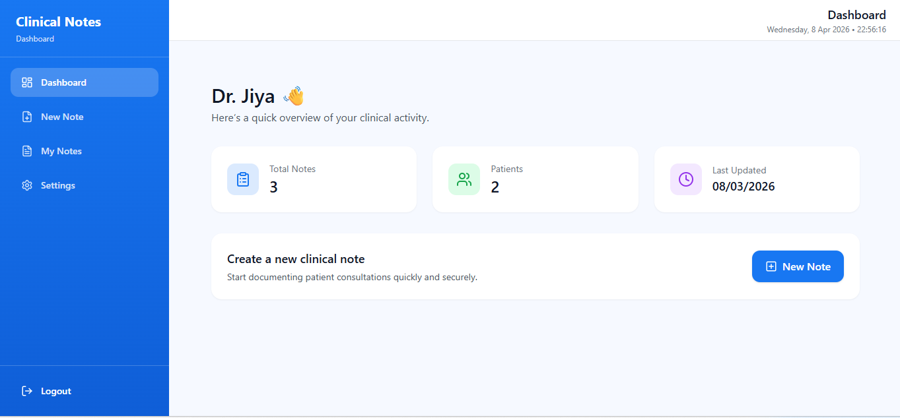
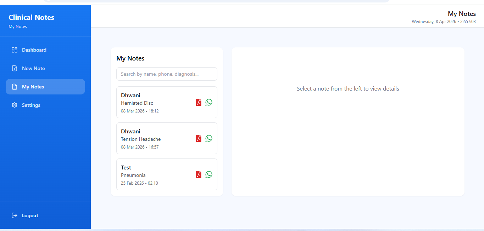

## Overview

AI Clinical Notes Assistant is a full-stack web application that helps users create and manage clinical notes with the help of AI-powered suggestions. Users can input patient details, receive intelligent suggestions, download reports, and share them via WhatsApp.

---

## Features

* Input patient details and clinical data
* AI-powered **suggestions** using Groq API
* Secure authentication (Register/Login with JWT)
* Data storage with MongoDB
* Dashboard to manage notes and patient data
* Download clinical notes as report
* Share reports via **WhatsApp**


---

## Tech Stack

### Frontend

* React.js
* Tailwind CSS

### Backend

* Node.js
* Express.js

### Database

* MongoDB (Mongoose)

### Authentication

* JWT (JSON Web Token)
* bcrypt.js

### APIs

* Groq API (AI suggestions)

---

## Screenshots

###  AI Suggestions



###  Dashboard



###  My Notes



---

## 🔗 Live Demo

https://clinicalnotes-appf.onrender.com/signup

---

## ⚙️ Run Locally (Optional)

```bash id="3g9h1l"
git clone https://github.com/dhwani1006/ClinicalNotes-App.git
npm install

# Run backend
cd backend
npm start

# Run frontend
cd frontend
npm start
```

---

## How It Works

1. User registers or logs in
2. Inputs patient details
3. Groq API provides AI suggestions
4. User creates structured notes manually with help of suggestions
5. Notes are saved and shown in MyNotes
6. User can download and share notes via WhatsApp

---

